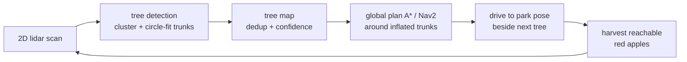
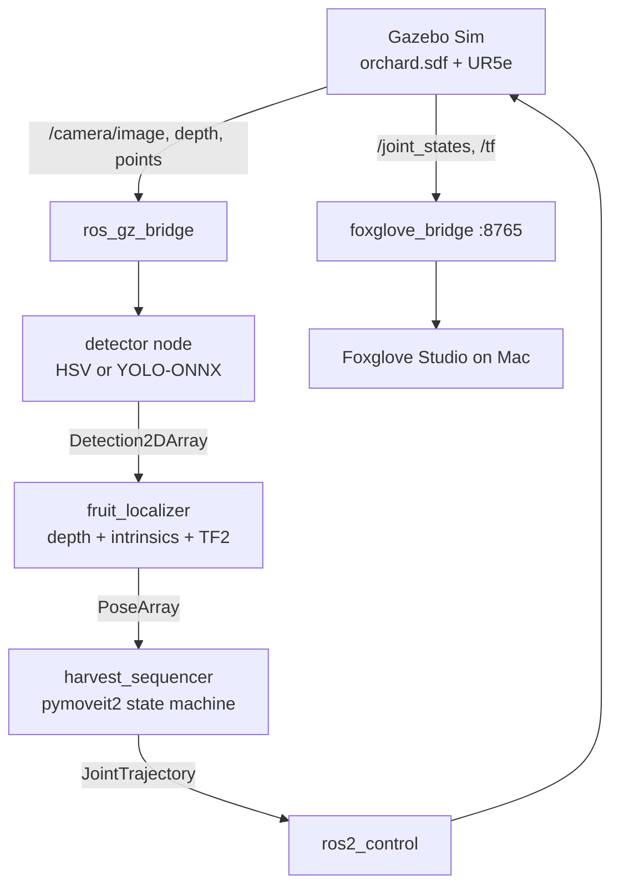

# AgriBot — Architecture

AgriBot is a simulated **autonomous orchard-harvesting robot**. It exists in two
complementary stacks that share one robot (a Universal Robots UR5e) and one
task (pick ripe fruit, leave unripe fruit):

- **Track A — ROS 2 systems stack** (Docker): the "real" robotics middleware —
  ROS 2 Humble, Gazebo Sim, MoveIt 2, `ros2_control`. This is the industry
  stack a robot would actually ship on.
- **Track B — learning / simulation stack** (native macOS): MuJoCo for fast
  physics + rendering, Gymnasium + Stable-Baselines3 for reinforcement
  learning, PyTorch + Ultralytics for perception. This is where the
  **comprehensive orchard-harvesting demo** and the learned policies live.

The design split is deliberate: heavy learning and high-fidelity rendering run
natively on Apple-Silicon GPU (fast), while the ROS integration runs in an
arm64 Docker container (portable, reproducible).

## The harvesting pipeline (Track B showcase)

```mermaid
flowchart LR
    A[Mobile base drives<br/>down the orchard row] --> B[Perceive: which apples<br/>are RED and reachable?]
    B --> C{ripe &<br/>in reach?}
    C -- no --> B
    C -- yes --> D[IK plan: damped least squares<br/>+ null-space posture bias]
    D --> E[Reach &#38; grasp<br/>force = f&#40;ripeness&#41;]
    E --> F[Store in onboard bin]
    F --> B
    B -- row done --> G[Harvest report:<br/>picked / left / score]
```

Key idea: **redness encodes ripeness encodes fragility.** A riper (redder)
apple tolerates less grip force (`tolerance = 1 - redness`); the controller
picks a gentle force within tolerance. Green (unripe) apples and out-of-reach
fruit are deliberately left — as a real selective harvester would.

## Component map

| Concern | Track B (MuJoCo showcase) | Track A (ROS 2 stack) |
|---|---|---|
| Robot model | `orchard/scene_builder.py` (procedural MJCF) | `ur_description` URDF via `ur_simulation_gz` |
| World | procedural orchard (N trees, branches, apples) | `agribot_bringup/worlds/orchard.sdf` |
| Perception | color = ripeness label (ground truth) | `agribot_perception`: HSV / YOLO-ONNX detector + depth/TF2 3D localizer |
| Motion | `orchard/ik.py` (hand-rolled DLS IK) | MoveIt 2 / OMPL via `pymoveit2` (`harvest_sequencer`) |
| Control | position servos + kinematic grasp | `ros2_control` trajectory controller + DeleteEntity "pick" |
| Learning | `training/` SAC/PPO reach policies | — (deploys ONNX models) |
| Viz | MuJoCo renderer → mp4 | `foxglove_bridge` → Foxglove Studio |

## Mobile field navigation (perceive → map → plan → drive)

Beyond harvesting at a fixed spot, the robot roams a **field of randomly-placed
trees**, finding and driving between them:

Two implementations of this loop, mirroring the two tracks:

| Stage | Track B (MuJoCo, runnable) | Track A (ROS 2, code) |
|---|---|---|
| Sensing | `mujoco.mj_ray` 360° scan (`orchard/lidar.py`) | gpu_lidar → `/scan` → `tree_detector` |
| Mapping | accumulate detections | `field_coordinator` tree map |
| Planning | A* on occupancy grid (`orchard/navigator.py`) | **Nav2** global+local planners |
| Localization | ground-truth base pose | **slam_toolbox** (map ← lidar) |
| Driving | planar base actuators | `/cmd_vel` → gz DiffDrive |
| Base | `orchard/field_harvester.py` | `agribot_description` diff-drive URDF |

The MuJoCo version runs end-to-end (`orchard.run_field_demo`,
`media/field_harvest.mp4`); the ROS 2 version (`agribot_navigation`) builds and
validates but is not run in the slow simulator.

## Data flow — Track A (ROS 2)

Track A status: the control level is verified live (arm spawns headless,
`/joint_states` streams, trajectory control works, Foxglove connects), and the
**full perception → localize → MoveIt harvest pipeline is implemented** —
`red_apple_detector` / `yolo_onnx_detector` → `fruit_localizer` →
`planning_scene_publisher` + `harvest_sequencer` (pymoveit2), plus the
`ros_gz` camera bridge and `harvest_demo.launch.py`. The whole workspace builds,
every node imports, and every launch file parses. It has not been run end-to-end
inside the (CPU-only, slow) Gazebo renderer; the working end-to-end *harvesting
behaviour* is demonstrated in Track B.

## Why these choices

- **Gazebo Sim (Fortress), not Gazebo Classic** — Classic is end-of-life and
  has no Humble UR package; `ur_simulation_gz` is the maintained path.
- **`ros:humble` arm64 base, not `osrf/...desktop-full`** — the latter is
  amd64-only and would emulate under QEMU (fatal for Gazebo speed).
- **MuJoCo for the showcase** — native Apple-Silicon speed + reliable
  offscreen rendering make a rich, watchable demo feasible where CPU-only
  Gazebo rendering would not.
- **Hand-rolled IK** — implementing DLS + null-space control is a learning
  goal, and it gives full control over the "reach the fruit, don't flail"
  behaviour.
